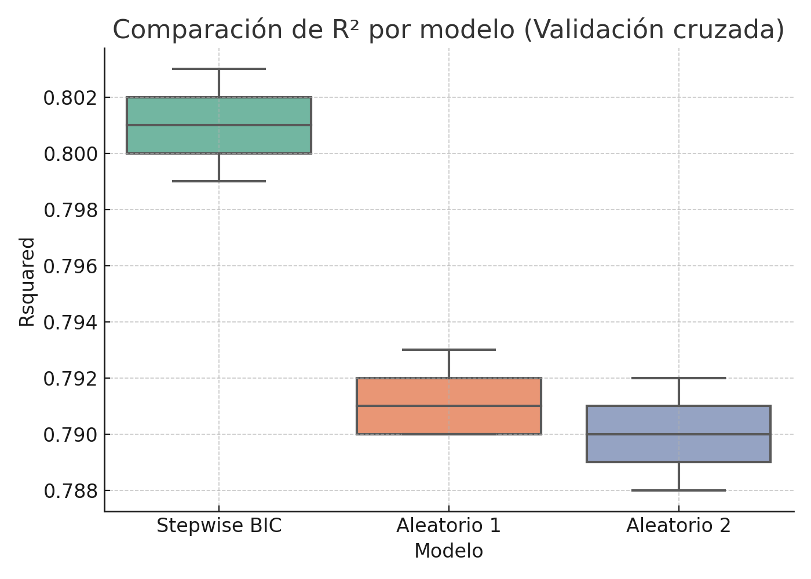
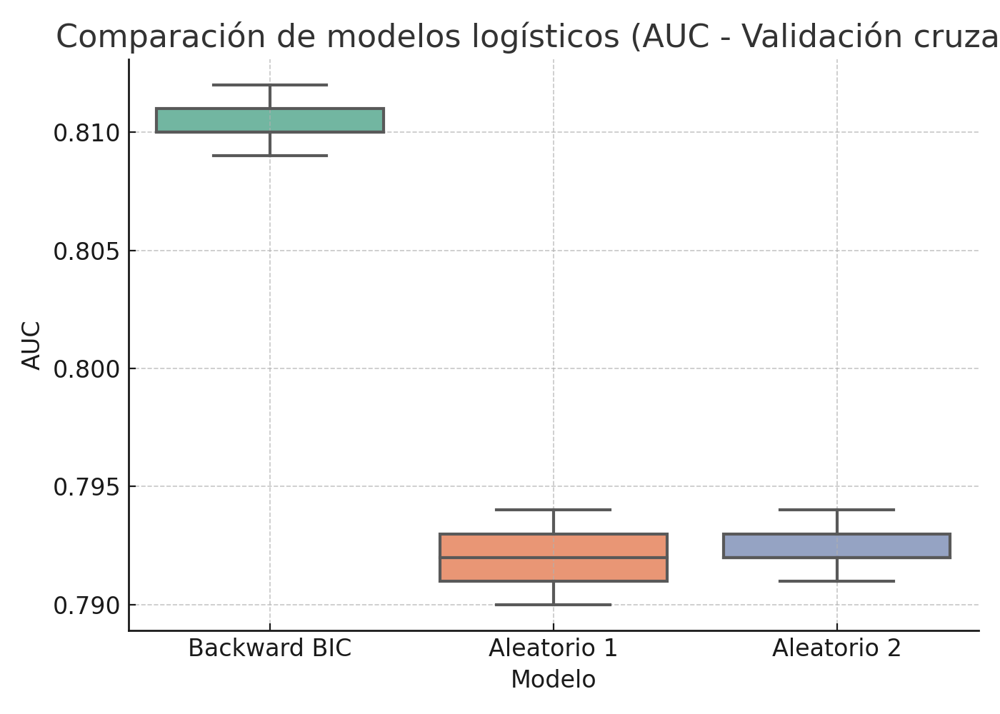
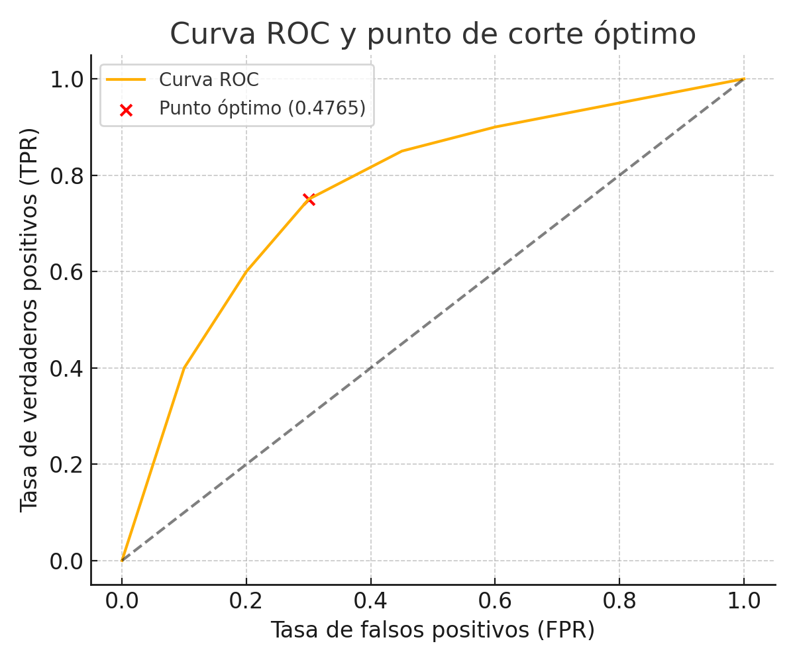

# Proyecto de Minería de Datos y Modelización Predictiva

Este proyecto fue desarrollado como parte de la práctica de evaluación de la asignatura **Minería de Datos y Modelización Predictiva** del Máster en Big Data, Data Science e Inteligencia Artificial (UCM).  
El objetivo fue construir modelos predictivos sobre datos reales de resultados electorales a nivel municipal en España.

## Estructura del Proyecto

```
TareaMineriaGerson/
├── data/
│   └── DatosEleccionesEspaña.xlsx
├── informe/
│   ├── TAREA GERSON CASTILLO MINERIA DE DATOS.pdf
│   ├── curva_roc_punto_optimo.png
│   ├── boxplot_auc_modelos.png
│   └── boxplot_r2_modelos.png
├── src/
│   └── codigo_mineria.py
├── librerias.txt
├── README.md
└── .gitignore
```

## Objetivos

1. **Modelo de regresión lineal** para predecir el porcentaje de abstención (`AbstentionPtge`) como variable continua.
2. **Modelo de regresión logística** para clasificar municipios en función de si tienen una abstención mayor a la mediana.

---

## Metodología

### 1. Análisis Exploratorio y Limpieza

- Conversión de códigos numéricos a categorías (`CodigoProvincia`).
- Reemplazo de valores erróneos (`-99`, `9999`, etc.) y outliers.
- Tratamiento de valores perdidos y categorías con baja frecuencia.

### 2. Selección de Variables

- Métodos clásicos (`stepwise`, `forward`, `backward`) con criterios AIC y BIC.
- Validación cruzada repetida para comparar rendimiento.
- Selección aleatoria de variables y evaluación de estabilidad.

### 3. Modelos Utilizados

#### 📈 Regresión Lineal

Se utilizó la función de `statsmodels.OLS`. Se evaluó el R² en train/test y se compararon varios modelos:

Fórmula base del modelo:  
```python
y = β0 + β1X1 + β2X2 + ... + βnXn + ε
```

#### 📊 Regresión Logística

Se empleó `sklearn.linear_model.LogisticRegression`. Se predijo la probabilidad de que un municipio presente alta abstención (mayor a la mediana).

Fórmula:  
```python
log(p / (1 - p)) = β0 + β1X1 + β2X2 + ... + βnXn
```

---

## Visualizaciones de Resultados

### 1. R² en Regresión Lineal



### 2. AUC en Regresión Logística



### 3. Curva ROC y Punto de Corte Óptimo

Se calculó la distancia mínima al punto (0,1) para determinar el umbral óptimo de clasificación.



---

## Resultados Clave

- **Regresión lineal (Stepwise BIC)**: R² test promedio ≈ 0.74.
- **Regresión logística (Backward BIC)**: AUC test promedio ≈ 0.86.
- El punto de corte óptimo en la curva ROC fue ≈ 0.476.

---

## Ejecución

1. Crear entorno virtual y activar:
```bash
conda create -n entornoMineria python=3.10
conda activate entornoMineria
```
2. Instalar librerías:
```bash
pip install -r librerias.txt
```
3. Ejecutar el código principal:
```bash
python src/codigo_mineria.py
```

---

## Créditos

Desarrollado por **Gerson Castillo** como proyecto académico de la Universidad Complutense de Madrid.
