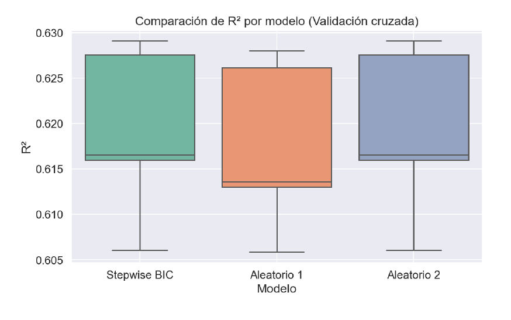

# Proyecto de Minería de Datos y Modelización Predictiva

Este proyecto ha sido desarrollado como parte de la práctica evaluable de la asignatura **Minería de Datos y Modelización Predictiva** del Máster en Big Data, Data Science e Inteligencia Artificial de la Universidad Complutense de Madrid.

El análisis se ha realizado utilizando Python, respetando una estructura modular en archivos `.py`, y ejecutado íntegramente en el entorno Spyder. No se ha utilizado generación automática de código ni asistencia de herramientas de IA.

---

## 📌 Objetivo

Construir dos modelos predictivos basados en resultados electorales municipales en España:

- **Modelo de Regresión Lineal:** predecir el porcentaje de abstención (`AbstentionPtge`).
- **Modelo de Regresión Logística:** predecir la probabilidad de `AbstenciónAlta` (abstención superior a la mediana nacional).

---

## 📁 Estructura del Proyecto

```
├── data/                         # Datos originales (.xlsx)
│   └── DatosEleccionesEspaña.xlsx
├── informe/                      # Informe y gráficos oficiales del análisis
│   ├── TAREA GERSON CASTILLO MINERIA DE DATOS.pdf
│   ├── boxplot_r2_modelos.png
│   ├── boxplot_auc_modelos.png
│   ├── curva_roc_optimo.png
├── src/                          # Código fuente
│   └── codigo_mineria.py
├── librerias.txt                 # Requisitos y entorno Python
└── README.md                     # Descripción del proyecto
```

---

## 🧪 Metodología y Modelos

### 1. Regresión Lineal

Se aplicaron múltiples estrategias de selección de variables:

- **Stepwise AIC / BIC**
- **Backward AIC / BIC**
- **Forward AIC / BIC**
- **Selección Aleatoria (30 iteraciones)**

El modelo ganador fue el **Stepwise BIC**, validado mediante 20 repeticiones de validación cruzada con 5 bloques.

📊 **Gráfico de R² en validación cruzada:**


### 2. Regresión Logística

La variable binaria `AbstenciónAlta` fue definida con respecto a la mediana de `AbstentionPtge`. Se aplicaron las mismas estrategias de selección y validación.

El modelo final seleccionado fue **Backward BIC**, con un AUC promedio superior en validación cruzada.

📊 **Boxplot AUC (Validación cruzada):**


📈 **Curva ROC y Punto de Corte Óptimo:**


📌 **Punto de corte óptimo identificado:** `0.4765`

---

## 📉 Interpretación de Coeficientes Logísticos

Dos variables destacadas en el modelo logístico final:

- `CCAA_Cataluña`: coeficiente = **+1.876**, indica mayor probabilidad de alta abstención.
- `WomanPopulationPtge`: coeficiente = **-0.042**, indica menor probabilidad de alta abstención con mayor proporción de mujeres.

---

## 📘 Referencias Utilizadas

- Documentos de clase: `Regresión_Lineal.pdf`, `Regresión_Logística.pdf`, `Selección_de_variables.pdf`
- Código base: `FuncionesMineria.py`, ejemplos oficiales del curso.
- Entorno: `entornoMineria` (Spyder, Python 3.9)

---

## 📌 Nota Final

Todo el trabajo ha sido realizado de forma **manual, estructurada y académicamente rigurosa**, incluyendo el preprocesamiento, la exploración, el modelado y la validación.

Este repositorio constituye la entrega oficial del trabajo final de la asignatura.
